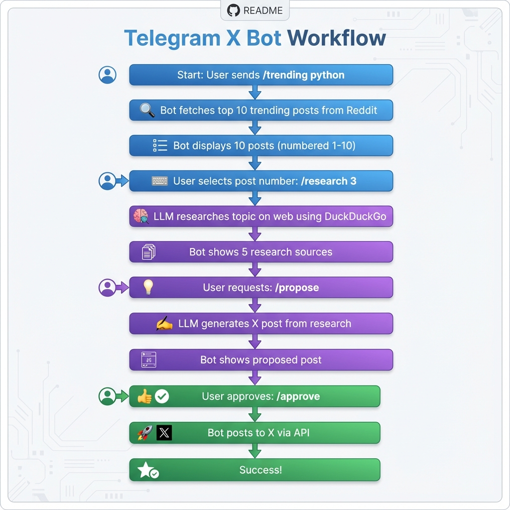

# Telegram X Bot 🤖

A Telegram bot that discovers trending topics on Reddit, researches them on the web, and generates AI-powered X posts using local LLM (Ollama). Completely free to operate!

## Workflow 🔄



## Features ✨

- � **Trending Discovery**: Find top 10 trending posts about any topic on Reddit
- � **Web Research**: LLM researches selected topics using DuckDuckGo search
- 🤖 **AI Content Generation**: Generate engaging X posts using local LLM (Ollama)
- ✅ **One-Click Posting**: Review and approve AI-generated posts to publish on X
- 🔒 **Single-User**: Secure, personal bot with user authentication
- 💰 **100% Free**: Uses free APIs and local LLM (no API costs)

## Prerequisites 📋

1. **Python 3.9+** installed on your system
2. **X (Twitter) Developer Account** with API credentials
3. **Telegram Bot Token** from [@BotFather](https://t.me/botfather)
4. **Ollama** installed locally for AI content generation

## Setup Guide 🚀

### 1. Get X API Credentials

1. Go to [developer.x.com](https://developer.x.com)
2. Sign in with your X account
3. Click **"Apply"** for developer access
4. Describe your use case (e.g., "Personal bot to analyze Farsi hashtags and generate content suggestions")
5. Once approved, create a **Project** and **App** in your Developer Dashboard
6. Navigate to **"Keys and Tokens"** section
7. Generate and save:
   - API Key (Consumer Key)
   - API Secret (Consumer Secret)
   - Access Token
   - Access Token Secret
8. Go to **"User authentication settings"**
9. Enable **OAuth 1.0a**
10. Set app permissions to **"Read and Write"**
11. **Important**: Regenerate your Access Token and Access Token Secret after changing permissions

### 2. Create Telegram Bot

1. Open Telegram and search for [@BotFather](https://t.me/botfather)
2. Send `/newbot` command
3. Follow the prompts to name your bot
4. Save the **Bot Token** provided by BotFather
5. Get your Telegram User ID:
   - Send `/start` to [@userinfobot](https://t.me/userinfobot)
   - Save your **User ID**

### 3. Install Ollama

1. Download Ollama from [ollama.ai](https://ollama.ai)
2. Install for your operating system (Mac/Windows/Linux)
3. Open terminal and pull a Farsi-capable model:
   ```bash
   ollama pull mistral
   # OR
   ollama pull llama3.2
   ```
4. Verify Ollama is running:
   ```bash
   curl http://localhost:11434/api/tags
   ```

### 4. Install Bot

1. Clone this repository:
   ```bash
   cd /Users/mahdihanifi/Documents/GitHub/Telgram_X_Bot
   ```

2. Create a virtual environment:
   ```bash
   python3 -m venv venv
   source venv/bin/activate  # On Windows: venv\Scripts\activate
   ```

3. Install dependencies:
   ```bash
   pip install -r requirements.txt
   ```

4. Configure environment variables:
   ```bash
   cp .env.example .env
   ```

5. Edit `.env` file with your credentials:
   ```
   TELEGRAM_BOT_TOKEN=your_bot_token_from_botfather
   TELEGRAM_USER_ID=your_telegram_user_id
   X_API_KEY=your_x_api_key
   X_API_SECRET=your_x_api_secret
   X_ACCESS_TOKEN=your_x_access_token
   X_ACCESS_TOKEN_SECRET=your_x_access_token_secret
   OLLAMA_HOST=http://localhost:11434
   OLLAMA_MODEL=mistral
   ```

6. Test configuration:
   ```bash
   python config.py
   ```

## Usage 🎯

### Start the Bot

```bash
python bot.py
```

You should see:
```
✅ Configuration validated successfully!
🤖 Starting Telegram X Bot...
✅ Bot is running! Press Ctrl+C to stop.
```

### Using the Bot in Telegram

1. **Discover trending topics**:
   ```
   /trending python
   ```
   - Bot fetches top 10 trending posts about Python from Reddit
   - Each post shown as a separate message with full text
   - Posts numbered 1-10 for easy selection

2. **Research a specific topic**:
   ```
   /research 3
   ```
   - LLM researches post #3 on the web using DuckDuckGo
   - Returns 5 top sources with summaries
   - All results in English

3. **Generate AI post**:
   ```
   /propose
   ```
   - LLM analyzes research results
   - Generates an engaging X post (max 280 characters)
   - Shows preview and character count

4. **Approve and post**:
   ```
   /approve
   ```

## Commands Reference 📚

| Command | Description | Example |
|---------|-------------|---------|
| `/start` | Show welcome message and instructions | `/start` |
| `/trending <topic>` | Find top 10 trending posts about a topic | `/trending python` |
| `/research <number>` | Research a specific post from trending results | `/research 3` |
| `/propose` | Generate AI post based on research | `/propose` |
| `/approve` | Post the proposed content to X | `/approve` |
| `/cancel` | Discard current proposal | `/cancel` |

## Workflow Example 🔄

```
You: /trending python
Bot: � Top 10 Trending Posts: python
     ━━━ Post #1 ━━━
     [Full post text about Python]
     👍 1,234 upvotes | 💬 56 comments
     
     ━━━ Post #2 ━━━
     [Another Python post]
     ...

You: /research 3
Bot: 🔬 Research: [Post #3 title]
     1. TechCrunch: "Python dominates..."
     2. Stack Overflow: "New Python features..."
     ...

You: /propose
Bot: 🤖 AI-Generated X Post
     📝 "Python continues to dominate in 2024..."
     📏 Length: 156 characters

You: /approve
Bot: ✅ Successfully posted to X!
     🔗 [Link to your tweet]
```

## Free Tier Limitations ⚠️

- **X API Free Tier**:
  - 500 posts per month
  - 50-100 read requests per month
  - This means ~50 hashtag searches and ~500 posts per month

- **Ollama**: No limits, runs locally on your machine

## Troubleshooting 🔧

### "Cannot connect to Ollama"
- Make sure Ollama is installed and running
- Check if the model is installed: `ollama list`
- Pull the model if needed: `ollama pull mistral`
- Verify Ollama is accessible: `curl http://localhost:11434/api/tags`

### "Error searching for posts"
- Check X API credentials in `.env` file
- Verify app permissions are set to "Read and Write"
- Ensure you haven't exceeded rate limits (50-100 searches/month)
- Regenerate Access Token after changing permissions

### "Unauthorized" message
- Verify `TELEGRAM_USER_ID` in `.env` matches your Telegram user ID
- Get your user ID from [@userinfobot](https://t.me/userinfobot)

### "Tweet too long"
- The AI should automatically limit to 280 characters
- If it fails, try regenerating with `/propose` again

## Project Structure 📁

```
Telgram_X_Bot/
├── bot.py                  # Main Telegram bot application
├── reddit_client.py        # Reddit API client for trending topics
├── research_client.py      # DuckDuckGo web research client
├── x_client.py            # X API client for posting tweets
├── content_generator.py   # Ollama-based AI content generation
├── models.py              # Data models (Post, ProposedPost, BotState)
├── config.py              # Configuration management
├── requirements.txt       # Python dependencies
├── workflow.png           # Workflow flowchart
├── .env.example          # Environment variables template
├── .env                  # Your credentials (not in git)
├── .gitignore           # Git ignore file
└── README.md            # This file
```

## Security Notes 🔒

- Never commit your `.env` file to version control
- Keep your API credentials secure
- The bot only responds to your Telegram user ID
- All AI processing happens locally (Ollama)

## Contributing 🤝

This is a personal bot, but feel free to fork and customize for your needs!

## License 📄

MIT License - feel free to use and modify as needed.

## Support 💬

If you encounter issues:
1. Check the troubleshooting section above
2. Verify all prerequisites are installed
3. Ensure API credentials are correct
4. Check that Ollama is running

---

**Made with ❤️ **
